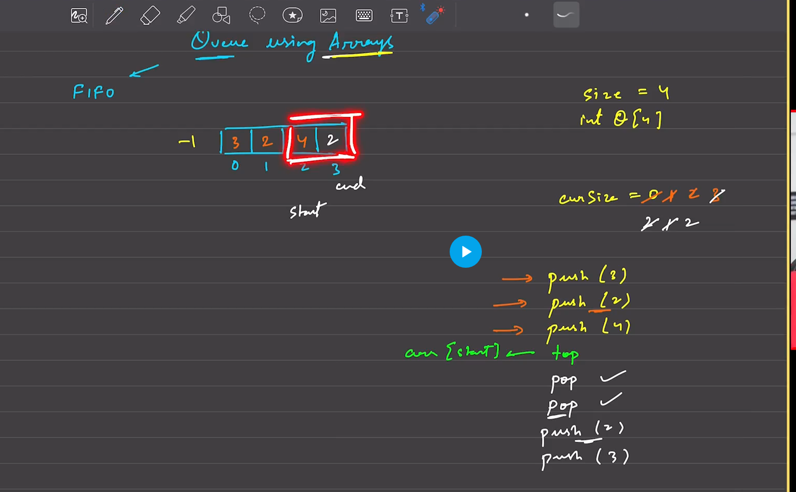
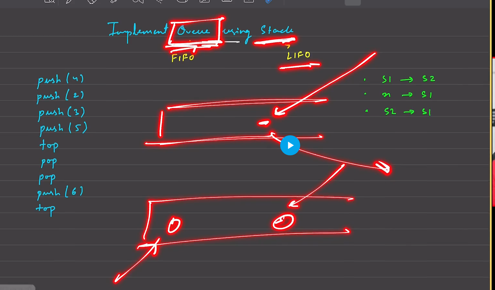

# Queue-fifo-container-first in first out

It can hold a certain type of data.Tuple,char,string etc.A queue is a linear data structure that follows the First In, First Out (FIFO) principle. This means that the first element added to the queue will be the first one to be removed. Queues are similar to a line of people waiting for a service where the first person in line is the first to be served. Common operations in a queue include

    Enqueue: Adding an element to the end of the queue.
    Dequeue: Removing the front element from the queue.
    Front/Peek: Retrieving the front element without removing it.
    Queues are widely used in scenarios like scheduling processes in operating systems, handling requests in web servers, and in breadth-first search algorithms.

    Understanding stacks and queues is fundamental in computer science as they provide the basis for more complex data structures and algorithms.

## implement ==>
    1)arrays
    2)linked list
    3)queue-->queue <int> st
    4)Using stack

## operations ==>
    push() 
    pop()
    top 
    size

    push(2)
    push(3)
    push(4)
    push(1) --->[2,3,4,1]
    pop()--->[3,4,1]
    top()-->1
    top()-->1
    pop()-->[4,1]
    push(5)-->[4,1,5]
    top()-->4
    size()-->3

##### In queue the reason for taking two variables start and end is that, we ne the 1st element during pop

---

## Queue using array ==>
    size is fixed in this->4
    know the size first :int st[10]
    cursize=0;
    start=-1,end=-1;
    PUSH 
        push==>start+=1,end+=1 -> index;cursize+=1->incement by 1
        2push==>start will be same,end+=1 -> index;cursize+=1
        2push=if end==sizeofarr==4;shift end=0;->end=(end+1)%sizeofarr;cursize+=1
    top=arr[start];
    POP
        pop==> start+=1, cursize-=1,end will be same
        Circular array
            2pop=if start==sizeofarr==4;shift start=0;->start=(start+1)%sizeofarr
        Destroy queue
            pop when start=1 then
            then start =-1,end=-1
    size==>top+1
    top==>st[top]
    best if u use a class