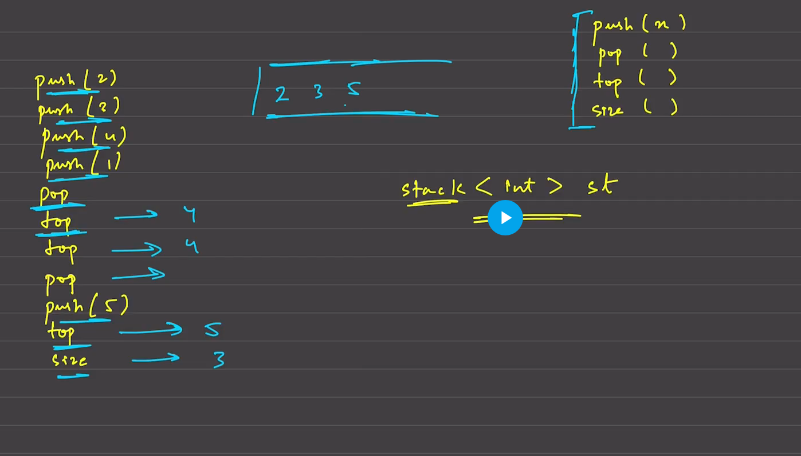

# Stack-lifo -container--last in first out 

It can hold a certain type of data.Tuple,char,string etc.A stack is a linear data structure that follows the Last In, First Out (LIFO) principle. This means that the last element added to the stack will be the first one to be removed. Stacks are analogous to a stack of plates where you can only add or remove plates from the top. Common operations in a stack include:

    Push: Adding an element to the top of the stack.
    Pop: Removing the top element from the stack.
    Peek/Top: Retrieving the top element without removing it.
## implement ==>  
    1)arrays
    2)linked list
    3)stack-->stack <int> st
    4)Using Queue
## operations ==>  
    push() 
    pop()
    top 
    size

    push(2)
    push(3)
    push(4)
    push(1) --->[2,3,4,1]
    pop()--->[2,3,4]
    top()-->4
    top()-->4
    pop()-->[2,3]
    push(5)-->[2,3,5]
    top()-->5
    size()-->3

---
## Stack using array ==>   
    size is fixed in this
    know the size first :int st[10]
    top=-1
    push==>top increments index
    pop==>top decrements index
    size==>top+1
    top==>st[top]
    best if u use a class


```cpp
pseudo code==>
    class stImpl{
        top=-1;int st[10];
        push(n){------------>TC=O(1),SC=O(N)
            if(top>=10){
                cout<<"stackoverflow";
            }
            else{
                top=top+1;
                st[top]=n;
            }  
        }
        top(){------------>TC=O(1)
            if(top==-1){
                return -1
            }
            else{
                return st[top];
            }
        }
        pop(){------------>TC=O(1)
            if(top==-1){
                cout<<"nothing to delete";
            }
            else{
                top=top-1;

            }
        }
        size(){------------>TC=O(1)
            return top+1;
        }

    }
```
---

## Stack Using a Linked list====>
    size will be dynamic in nature
    top=NULL;
    push()==>create node with num, next =>NULL,top points to 1st node
    2push()=>create node with num, 1stpush next==>2nd node, n 2nd node next=>NULL;top=>2nd node
    pop==>
        temp=top;
        top=top->next;
        delete temp;


```cpp
Pseudo Code==>
    class stUsingll{ ===>TC=O(1),SC=O(N)
        Node * top;//NUll pointer
        size=0;

        push(n){
            Node * temp = new Node(n);
            temp->next= top;
            top=temp;
            size +=1;  
        }
        pop(){
            temp=top;
            top=top->next;
            delete temp;
            size -=1;
        }
        size(){
            return size;
        }
    }
```

